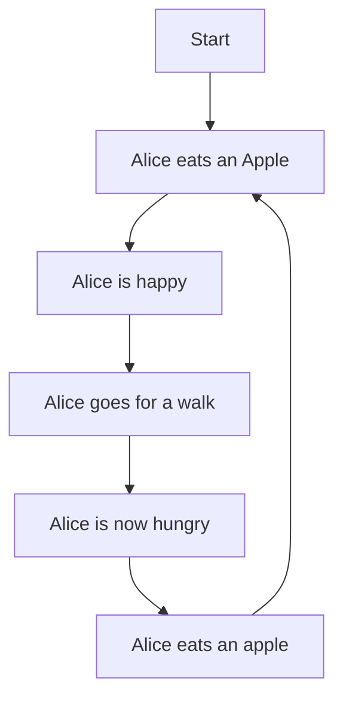

This website presumes you have an undergraduate or high-school level understanding of computers and data structures.

### Data structures

These are just ways to structure data. There are primitive data types in every language, but they too are built off on other data structures. Something as bare-metal as a system reading a CD depends on data structures as.

(Source [expertsmind.com](https://www.expertsmind.com/questions/block-format-and-disk-layout-on-cd-rom-30191157.aspx))

As we go up the stack, we meet data structures at every level. Sliding Window protocol in networking is a data structure. The way a CPU stores data in registers is a data structure. Everything is a data structure. Unfortunately, due to all the "crack the coding interview" approach to data structures and algorithms (or DSA as is popularly known in Indian schools), we have lost the forest for the trees. We have forgotten that data structures are just ways to structure data. We have forgotten that algorithms are just ways to solve problems. We have forgotten that the goal is to solve problems, not to know the most number of algorithms. I would also take this opportunity to blame some of this on dynamically typed languages - why? That is an exercise left to the reader. 

The popular data structures are fairly easy to understand, if you're somewhat familiar with programming, you can cruise through the popular ones in a couple days. Trees, linked lists, graphs etc. The visualisations help, but are also limiting, and make you believe these are some abstract woo-woo magic happening in the background. They are not. They are just ways to structure data, manifesting in a very real in every action you take on a computer.

1. **Arrays**: In operating systems, arrays are used to implement buffers which temporarily store data as it is being transferred between two areas in a computer, such as between the RAM and the CPU.
   
2. **Linked Lists**: File systems employ linked lists to manage fragmented files, with each node pointing to a different fragment of a file stored non-contiguously on a disk.

3. **Stacks**: Stacks facilitate function call management in programming languages, where function parameters, return addresses, and local variables are stored to maintain the correct execution order.

4. **Queues**: In network routers, queues manage data packets in a first-come-first-serve manner to regulate the transmission order based on the arrival time of the packets.

5. **Hash Tables**: Databases use hash tables to index data, allowing for faster retrieval of information based on a unique key.

6. **Trees**: B-trees are utilized in databases to index records, facilitating quicker searches, inserts, and deletes operations.

7. **Graphs**: Networks utilize graph data structures to represent the interconnection of nodes and routers, aiding in the determination of optimal paths for data transmission.

8. **Tries (prefix trees)**: Networking protocols employ tries to efficiently store and lookup IP addresses in routing tables, aiding in the fast routing of data packets.

9. **Heaps**: Operating systems utilize binary heaps in scheduling algorithms to quickly find the highest-priority task to execute next.

### Algorithms

Algorithms are ways to approach what to do with the data you just structured. For example, you work on the Google Maps team, it is 2005, you are about to launch. You store every place as a node instance on an undirected graph. You have to implment the direction feature. How would you do it? Djiksta's algorithm is probably a safe bet given you have a weight on every edge for the direction. Of course this is an oversimplified example, but you get the point. Algorithms are just ways to solve problems. Don't let the abstraction of these ideas get to your head. 

### Theory of Computation

Throughout this section, I will use the example of building either previously mentioned Maps component or compilers, both are conceptually the same. Actually, a lot of our problems in general are conceptually the same. We have a set of inputs, we have a set of outputs, we have a set of rules to convert inputs to outputs yada-yada.

Let's start with automata theory.

#### Automata Theory

These are abstract machines, they do not exist in the real world. They are, however, helpful models of thinking about the world. Here is a simple automata representation of the following pseudocode: Alice eats an Apple, Alice is happy, Alice goes for a walk, Alice is now hungry, she eats an apple. 

Now extend these ideas to general automata theory. We have a set of inputs, we have a set of outputs, we have a set of rules to convert inputs to outputs. We can represent this as a graph. We can represent this as a state machine. We can represent this as an automata. And there are many types of automata ect.

#### Turing Machines

A Turing machine is an abstract mathematical model of computation that consists of a tape divided into cells, a read/write head that can move left or right along the tape, a finite set of states, and a set of transition rules that dictate how the machine should behave based on its current state and the symbol it reads from the tape. It can perform a wide range of computational tasks, making it a foundational concept in the theory of computation and a theoretical basis for modern computers. The Turing machine's ability to simulate any algorithmic process makes it a fundamental concept in computer science and the study of computability and complexity.

Complex looking stuff! I wouldn't want this on an exam because I used to stay up to study and hallucinate things. But really, once you understand the basics, the concepts really stick and it becomes so obvious.

Try to work through [this](https://www.geeksforgeeks.org/turing-machine-addition/) horrible example (Sorry Rishabh!)